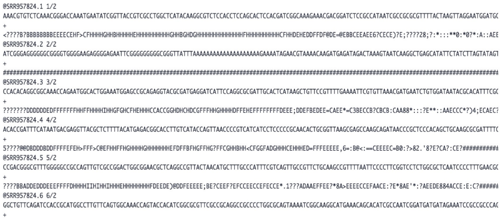
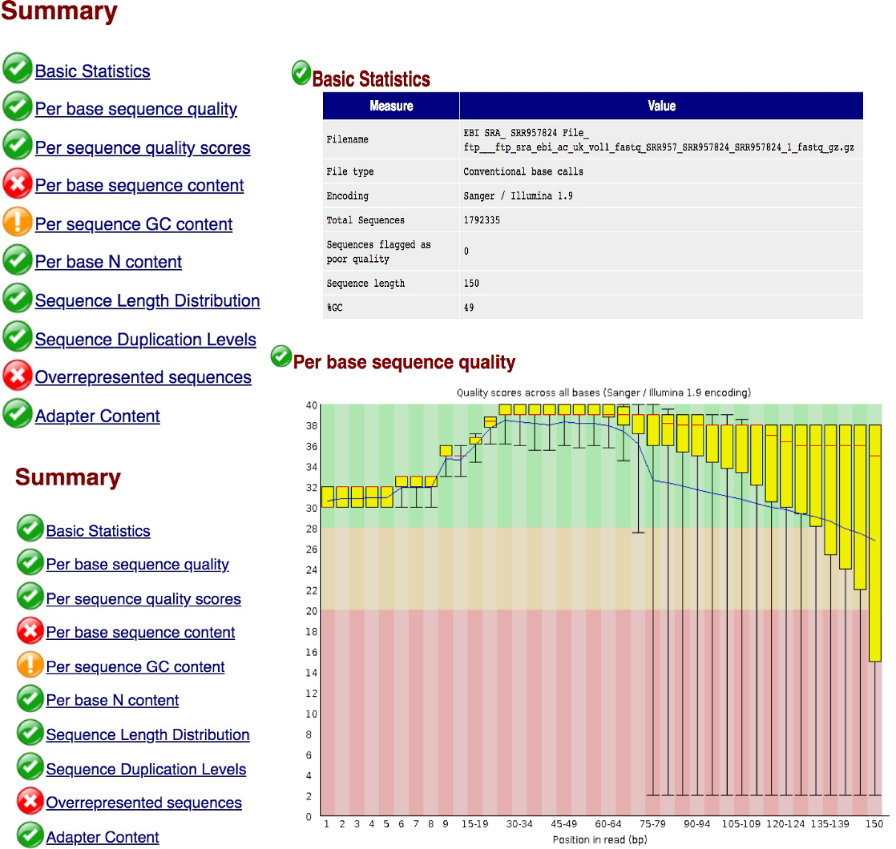
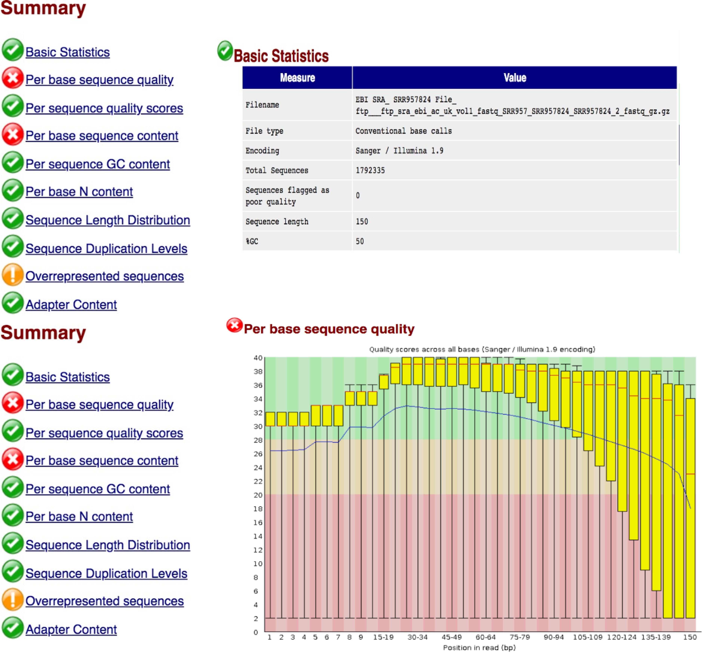
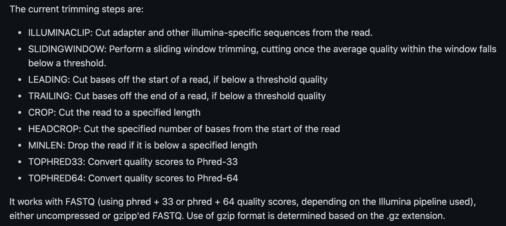

# Sequencing Data Processing and QC

## **FASTQ Data QC**

### **Introduction**

In the assignment, you will have an opportunity to view and run a set of
FASTQ files through the FASTQC program and assess the html output
reports.

-   *View raw high throughput sequencing files (FASTQ).*

-   *Check the quality of the dataset = run a standard QC pipeline.*

    -   *This step is crucial to ensure that your dataset is of good
        quality before you continue further with the analysis.*

-   *Remove adapters and low quality reads from the dataset.*

-   *Compare a « good » and a « bad » quality dataset.*

### **Tools used in this session**

*FASTQC -*
[*https://www.bioinformatics.babraham.ac.uk/projects/fastqc/*](https://www.bioinformatics.babraham.ac.uk/projects/fastqc/)

*Trimmomatic - <https://github.com/usadellab/Trimmomatic>*

**Please note**
**Hand-in information**             
Please upload your completed assignment via the Vula 'Assignments' tab. Take note of the final hand-in date for each assignment, which will be indicated on Vula. Make use of the editable docx file on Vula to fill in your answers. 

### **Task 1: Quality Control of a FASTQ dataset**

The datasets for this assignment can be found on your VM here:

```
~/course_data/data_formats/data*
```

The dataset you will be working with first is paired end reads from an
Escherichia coli K1 sample. The data has been produced on the Illumina
MiSeq platform and is stored in the SRR957824.zip archive.
```
cd /course_data/data_formats/data
```
Unzip the SRR957824 archive and cd into the unzipped directory
```
gunzip SRR957824
cd SRR957824
```
View the files in the directory.
```
ls SRR957824
```
View the FASTQ files
```
zcat SRR957824_1.fastq.gz | less
```
Tip: You can use the *space bar* to scroll through the file and *Q* to quit. The suffix of _1 indicates that the file contains data for Read1.


Using a similar approach you can view the contents of the Read2 file.

```
zcat SRR957824_2.fastq.gz
```



### Questions:
**Question 1: Why are there two files for the single sample dataset?**

**Task 2: Run FASTQC on your dataset**

The next step is to access the quality of our raw reads. We will do this
by running FASTQC on our dataset.

```
fastqc SRR957824_1.fastq.gz
```

You may also run the analysis in parallel if you have multiple FASTQ
files in a single directory.

```
fastqc SRR957824_1.fastq.gz SRR957824_2.fastq.gz
```

or using a wildcard

```
fastqc \*.fastq.gz
```

Tip: A tool called MultiQC (<https://multiqc.info/>) can be used to
combine the results from several QC outputs into a single report. This
may be useful when working with a large number of samples. FASTQC can
also be run via a graphical user interface, via the terminal or in R
Studio (fastqcr package).

Once the analysis is complete, you will notice that new files with a
.html extension will be generated. This file contained the information
report and images produced by the FASTQC program. We will open the file
in the Firefox browser.

```
firefox SRR957824_1_fastqc.html
```



This command should open the html report for read1 in the Firefox
browser

In a similar way open the quality control report for Read2.

```
firefox SRR957824_2_fastqc.html
```



**Task 3: Interpretation of QC report**

Compare the quality control reports for the two FASTQ files.

**Question 2: Comment on the quality of the sequenced reads in file 1
and file 2.**

Read through the other reports in the FASTQC output html file and ensure
that you understand the information in each report.

**Question 3: What can be done to improve the quality of the reads?**

### **Trimming**

Trimming can be done using a tool called [Trimmomatic](https://github.com/usadellab/Trimmomatic)



Below is an example for using Trimmomatic. Trimmomatic will produce both
paired and unpaired datasets from a paired-end set of FASTQ files. The
file ILLUMINACLIP:TrueSeq3-PE.fa contains the adapter sequences
associated with that sequencing platform.


Run the command below in order to trim your fastq files. Ensure that you understand what each of the options in the command means.            
```
trimmomatic PE SRR957824_1.fastq SRR957824_2.fastq SRR957824_1_paired.fq.gz SRR957824_1_unpaired.fq.gz SRR957824_2_paired.fq.gz SRR957824_2_unpaired.fq.gz LEADING:15 TRAILING:15 SLIDINGWINDOW:4:20 MINLEN:100
```
**Question 4: Explain what each of the options in the trimmomatic
command above specifying. i.e. LEADING, TRAILING, SLIDINGWINDOW,
MINLEN.**

If you list your files again you will notice that you now have some new
unpaired and paired .fq.gz files. These are your qc'd files that have
been trimmed using Trimmomatic in the last step. To see the effect of
your trimming on your new files, run FASTQC on the paired output files
as you have done previously. Compare the output of the first FASTQC run
and the second FASTQC run.

**Question 5: Comment on the quality of your two trimmed read files.
Have you improved the quality of your data? How many reads have you lost
for each file by trimming the data? Please note any other improvements
in the dataset.**
