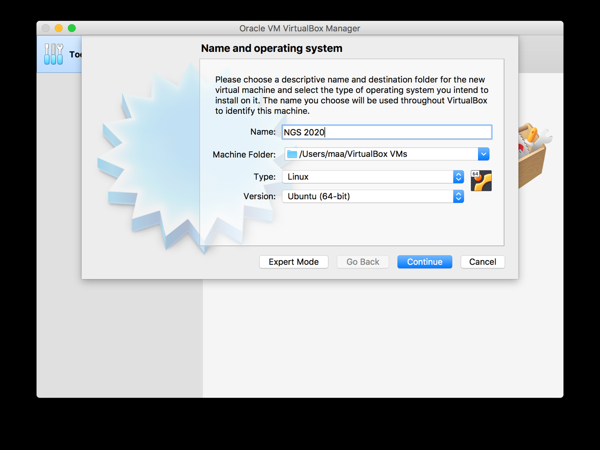
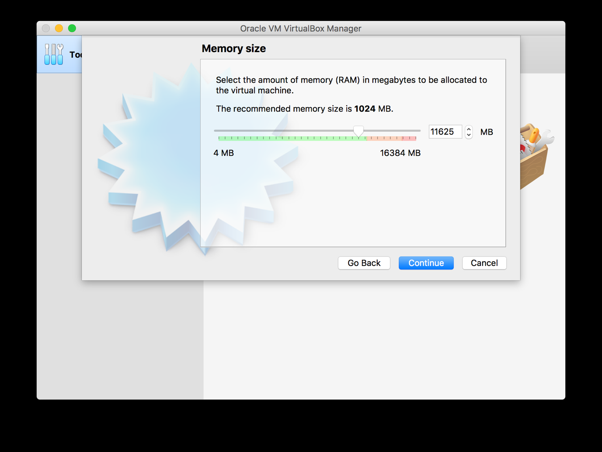
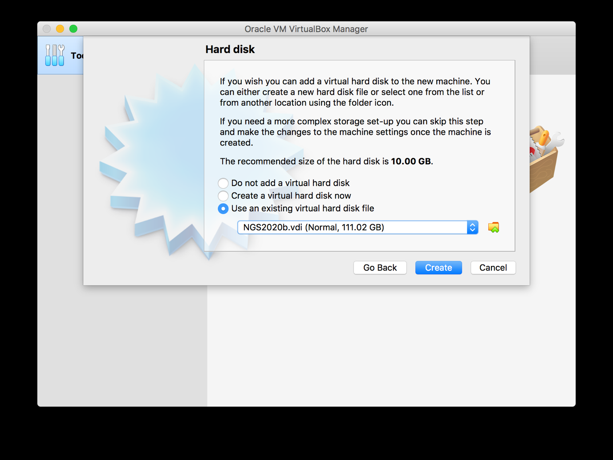
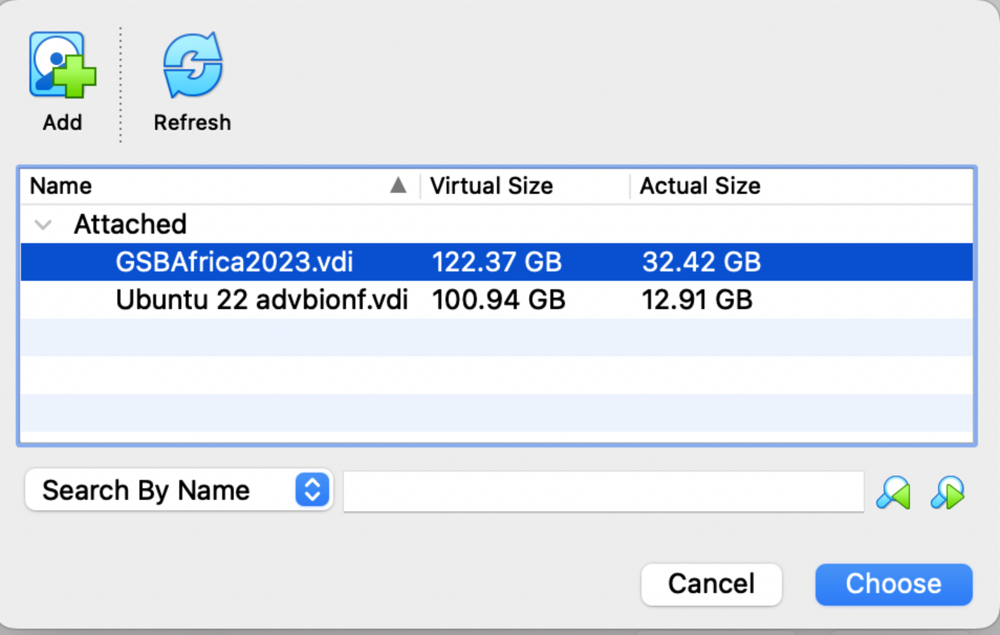
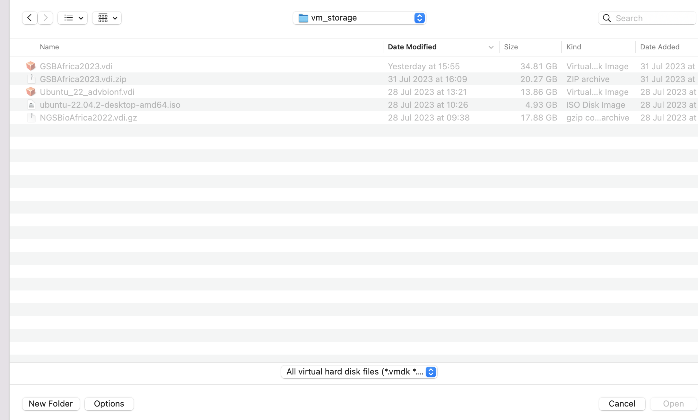
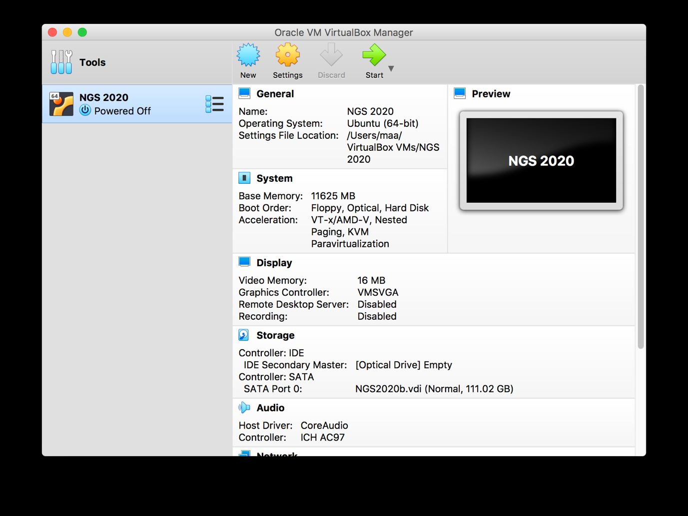
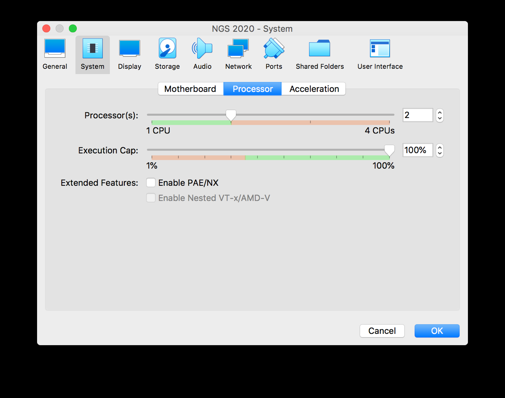
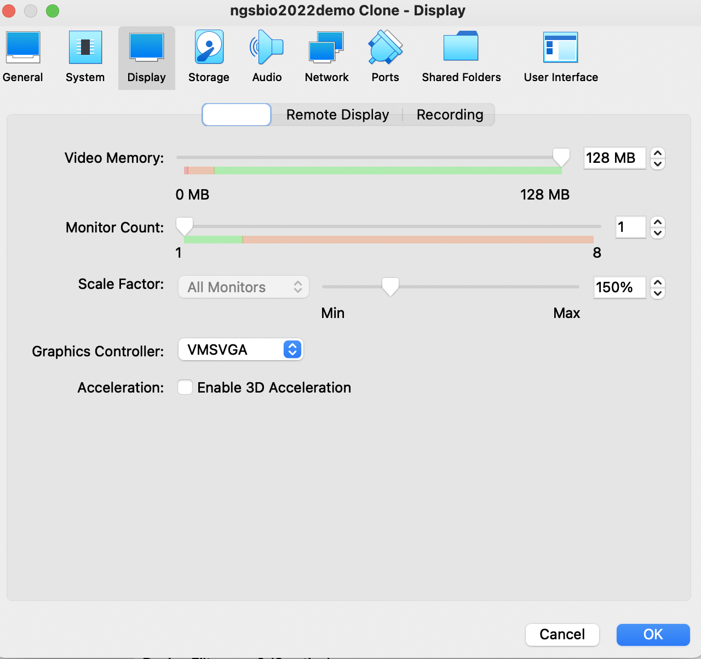
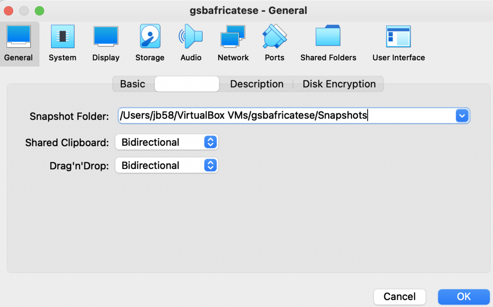
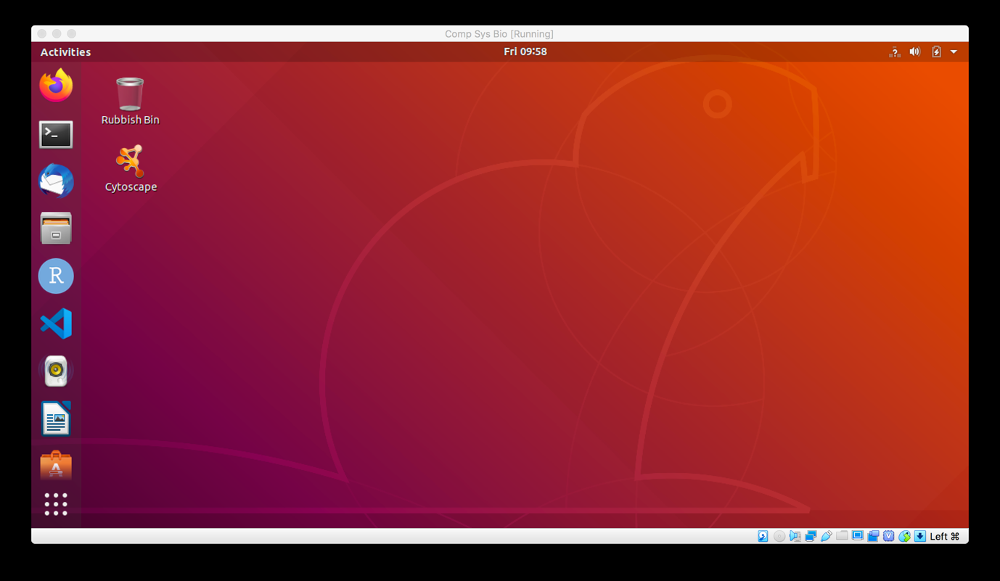

**Install VirtualBox and the course Virtual Machine**

VirtualBox is freely available software which allows a user to run a virtual machine on their host computer, meaning that they can run, as we will, a preconfigured Linux operating system on Windows, OSX, or unix. The virtual machine contains all of the software and data to be used during the course. 

#### Course VM name
The GSBAfrica course VM is **GSBAfrica2023.vdi.zip*
There is also a video of this tutorial, but this was made for a previous course, and the names of the machine will be different to your current course. Please make note of the name of your virtual machine.

<iframe width="840" height="472" src="https://www.youtube.com/embed//Q7dQTov5pAk" title="YouTube video player" frameborder="0" allow="accelerometer; autoplay; clipboard-write; encrypted-media; gyroscope; picture-in-picture; web-share" allowfullscreen></iframe>         

**Installation of VirtualBox Version 6**

VirtualBox version 6 is available from this website:

[https://www.virtualbox.org/wiki/Download_Old_Builds_6_1](https://www.virtualbox.org/wiki/Download_Old_Builds_6_1)

We are using Version 6 as this was the version used to build the  **GSBAfrica2023.vdi.zip* VM. You may use the current version, but may encounter performance loss. 

Please download the installer for the operating system of your computer and run through the installation process. **PLEASE NOTE:** admin rights to your computer are required to install VirtualBox.

Also, **please note** that VirtualBox will not, as yet, run on a new Apple Mac with the M1 or M2 chip set. You will need to find another machine to work on for the course

After installation of VirtualBox, you should also install the VirtualBox extension pack, which is available on the same page. The installation process for this should start after download. The extension pack is not essential but does include many useful features e.g. the ability to attach a USB drive to the virtual machine.

Once VirtualBox and its extension pack are installed, running the software should give a manager window similar to this:

Note that this is the OSX version of VirtualBox. The Windows and linux interface differs slightly.

**Download of the Virtual Machine**

The virtual machine is stored as one large file. It can be downloaded using Globus, and a guide for this is on the manual homepage.

**Setting Up the Virtual Machine**

PLEASE NOTE: The example images below are taken from previous/different courses. Use the name of your course VM where prompted. 

Once the virtual machine file has downloaded successfully, you can start to set the virtual machine up. To do so:

1. Click the New button as seen on the above screenshot.

2. This leads to a window similar to this:

Give a name to your machine. This can be anything but it makes sense to name it with something related to the course.

Next, set the Type to 'Linux' and the version to 'Ubuntu (64-bit)'. Ubuntu is the precise version of Linux we use for this course. Once done, click the Continue button.

3. This leads to a window allowing you to set the memory (RAM) allocated to the virtual machine:

The amount of memory you may allocate differs from machine to machine, depending on how much your computer has. For the course, it's best to set the memory as high as possible whilst leaving enough to run your computer's operating system. Thus, we advise that you set the memory so that it is close to the top end of the green part of the line in the above screenshot but not so high that the pointer reaches the pink part of the line. Once the memory is set, click the Continue button.

4. The next thing to do is to point VirtualBox to the virtual machine file you have downloaded. If you dont find a file, remember to uncompress the downloaded zip file first. 

Select the 'Use an existing virtual hard disk file' and click the yellow and green icon to the right of the pulldown menu. This should lead to a window similar to this:

Click the Add button on the top left and choose the .vdi file you have downloaded. 

This file will then appear in a list of Unattached files in the above window. Highlight it and click Choose.

The next step after this is to click the create button. If all has gone
correctly, the manager window should now show looking like this:

5. We need to set the number of processors it can access. To do this, highlight your VM in the manager window as above and click the Setting button. Choose System then Processor. Similar to setting memory, set the number of processors (CPUs) used to the upper limit of the green part of the line:

As with memory, the number of processors you may use will depend on your host machine.

You may also find that changing the video memory under the display tab to 128MB will help avoid black screen and other display issues.

Copy pasting between your pc and the VM is useful. Click General - then the Advanced tab, and enable copy paste between the host and VM by changing the Shared Clipboard and Drag'n'drop to "Birectional":

6. All that remains now is to start the virtual machine. On the manager window, highlight your virtual machine's name and click the 'Start'
icon. The virtual machine should run through a boot process and, after a short time, you should see a window similar to this:

If your VM fails to boot, take note of the error, and check the sections for Frequently asked Questions on the manual homepage. 

#### The password on the VM
The user account on the virtual machine is named 'manager' and the password, if required, is also 'manager'.

#### Keyboard mapping on the VM
Now that you VM has started, check that the keyboard has mapped correctly to the virtual machine (the VM may be expecting a different keyboard)

/ \\ \| @ \~ & \#

In the VM, check the settings, then keyboard settings, and check that the keyboard versions and locations are matched.
See this guide for more info on keyboard mapping: [https://help.ubuntu.com/stable/ubuntu-help/keyboard-layouts.html.en](https://help.ubuntu.com/stable/ubuntu-help/keyboard-layouts.html.en)
